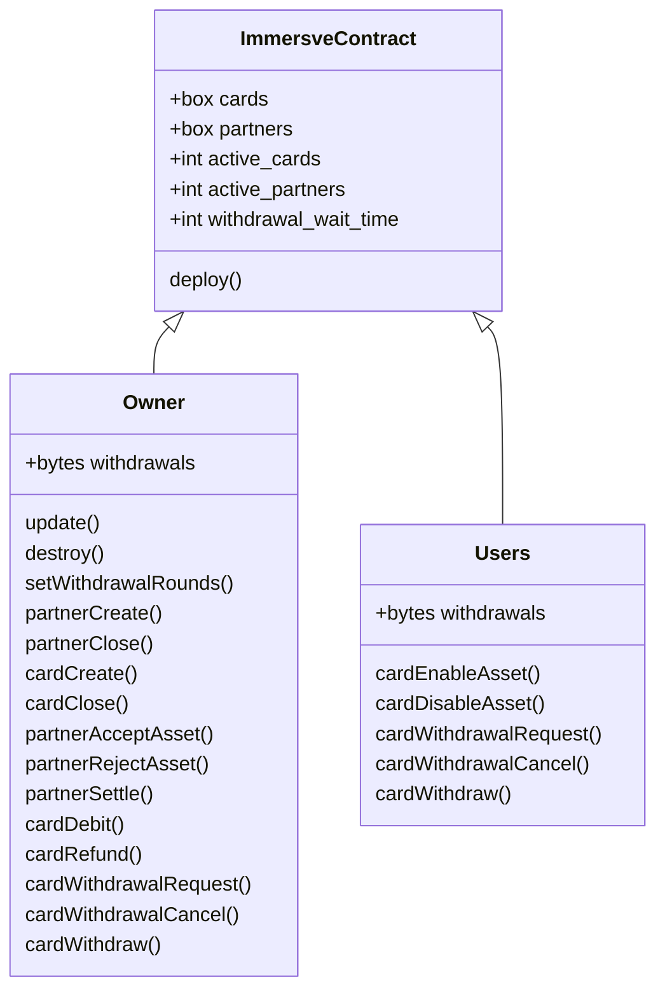
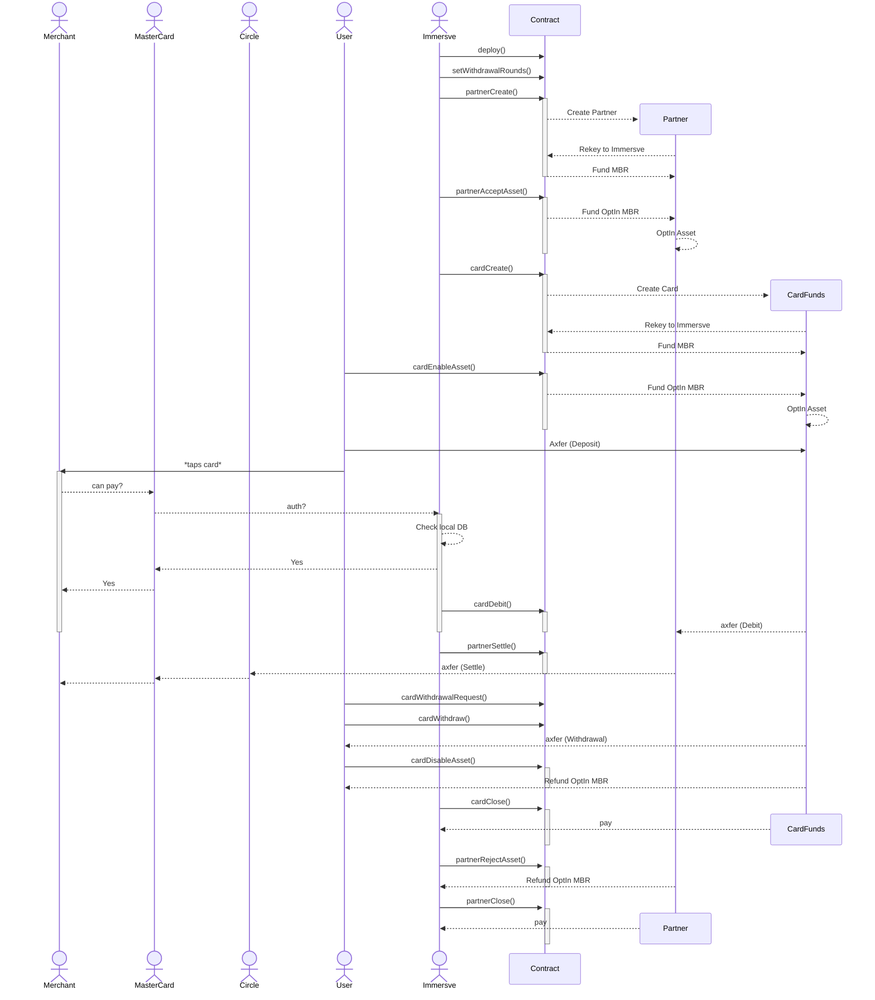

# Immersve Concept

This concept uses a single contract that "generates" new addresses for each partner and card that's created.




## Usage

To install dependencies:

```bash
bun install
```

To run, make sure you have `goal` set locally for sandbox. Do not accidentally run this on a computer with Mainnet, it defaults to the first 2 accounts in KMD.

```bash
./test.sh
```
## Methods

### deploy()void
 Deploy the smart contract, setting the transaction sender as the admin
### update()void
 Allows the admin to update the smart contract
### destroy()void
 Destroy the smart contract, sending all Algo to the admin account. This can only be done if there are no active cards
### setWithdrawalRounds(uint64)void
 Set the number of rounds a withdrawal request must wait until being withdrawn
### cardCreate(pay,string,address)address
 Create account. This generates a brand new account and funds the minimum balance requirement
### cardClose(string,address,account)void
 Close account. This permanently removes the rekey and deletes the account from the ledger
### cardAddAsset(pay,string,account,asset)void
 Allows the owner (or admin) to OptIn to an asset, increasing the minimum balance requirement of the account
### cardRemoveAsset(string,account,asset)void
 Allows the owner (or admin) to CloseOut of an asset, reducing the minimum balance requirement of the account
### cardDebit(account,account,asset,uint64)void
 Allows the admin to send an amount of assets from the account
### cardWithdrawalRequest(string,account,asset,uint64)byte[32]
 Allows the owner to send an amount of assets from the account
### cardWithdrawalCancel(string,account,byte[32])void
 Allows the owner (or admin) to cancel a withdrawal request
### cardWithdraw(string,account,account,asset,byte[32])void
 Allows the owner to send an amount of assets from the account
